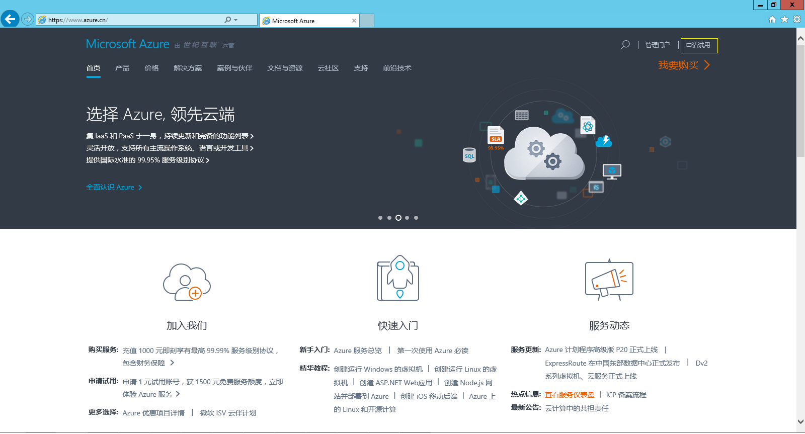
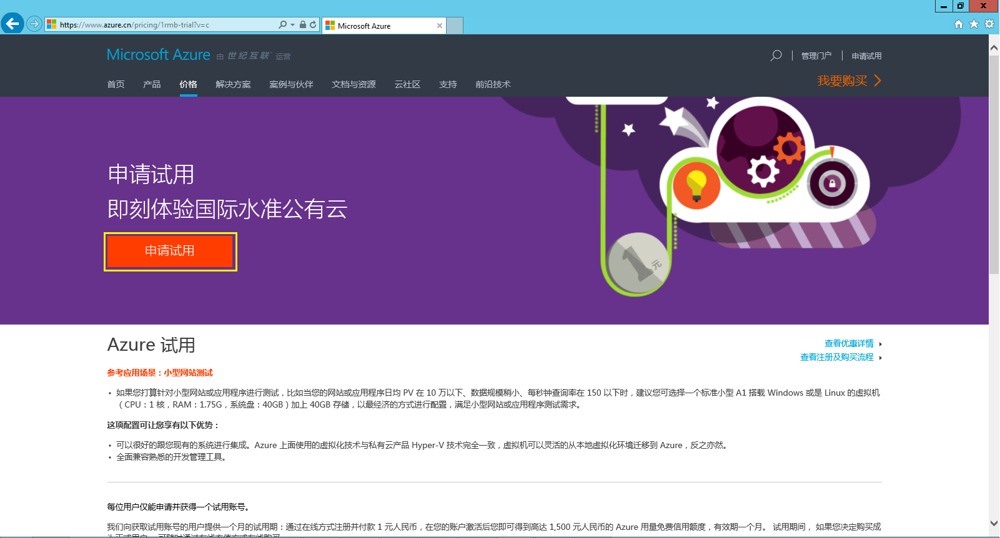
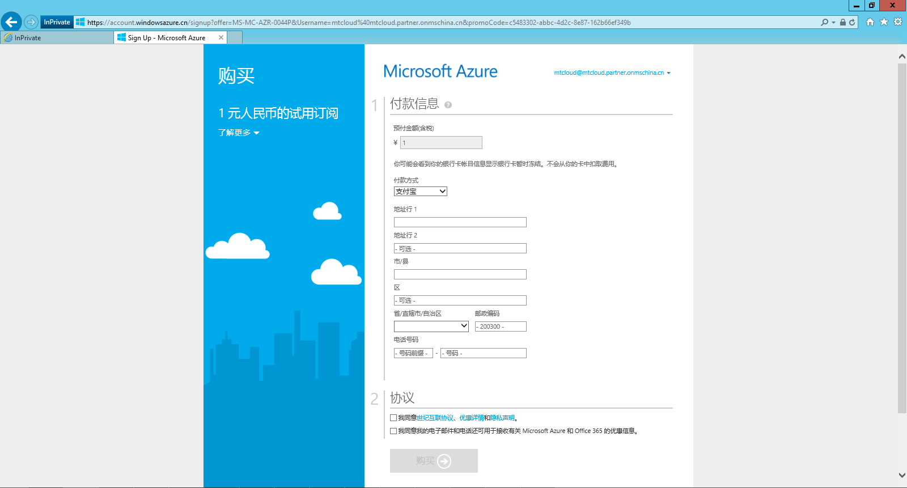
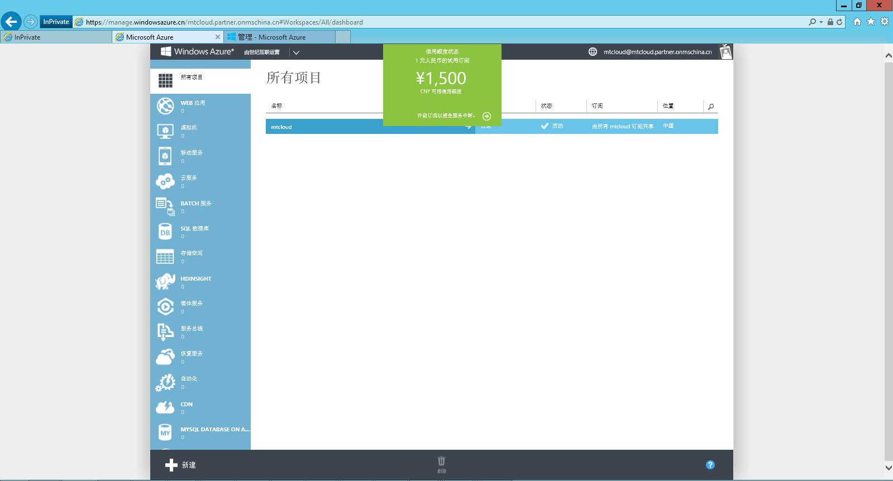

# Azure 在线直付注册流程（1RMB）

- [获得邀请码流程](#getcode)
- [注册流程](#register)
- [查看订阅详情及使用 Azure 管理门户](#info)

## 获得邀请码流程

登录 [Azure 官方网站](https://www.azure.cn),找到申请试用，然后填写试用申请表。

## 注册流程

世纪互联会审核之前我们提交的信息，之后我们会收到邮件如下图，这期间可能需要一些时间，请耐心等待：

请复制邮件中的激活码，然后点击“输入激活码页”或者直接点击邮件中的注册网址开始注册：

输入域名然后点击检查可用性

填入您的手机号码发送验证码，输入验证码点击“验证代码”，然后点击继续，这时跳入登入页面，输入之前设置的密码进行登录，同时我们也会收到世纪互联发送的关于我们 Azure 体验账号相关信息的邮件

登录成功后进入付款页面。

输入个人相关信息，点击“购买”（例子中为支付宝支付方式）

扫一扫完成支付，之后页面会跳转到Azure验证付款，整个注册就完成了。

## 查看订阅详情及使用 Azure 管理门户

点击“1元人民币的试用订阅”查看订阅的使用情况，或者点击 [Azure 账户门户](https://account.windowsazure.cn/)，点击右上角登陆。

点击“门户”进入Azure管理门户

点击门户网站绿色的按钮查看大致的消费情况。

