# Azure 在线直付注册流程（预付费）

- [获得邀请码流程](#getcode)
- [注册流程](#register)

## 获得邀请码流程

登录 [Azure 官方网站](https://www.azure.cn)，点击“我要购买”。 

点击“我是新用户，购买Azure预付费产品”

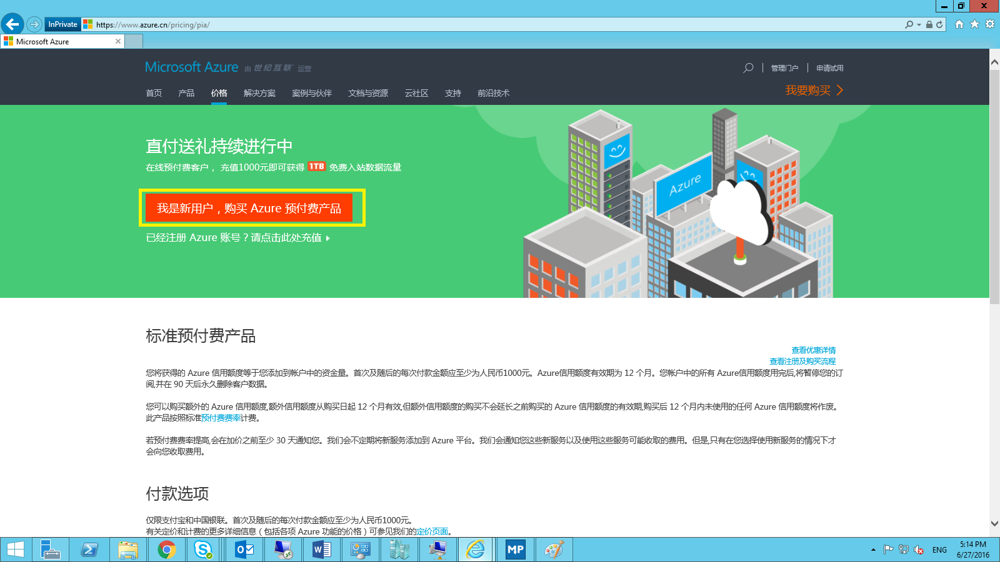

填写Azure预付费产品购买申请表

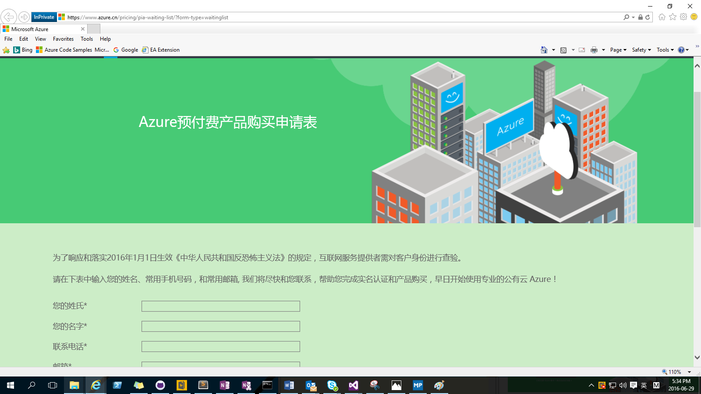

之后您会受到相关邮件，下面是邮件内容的相关截图

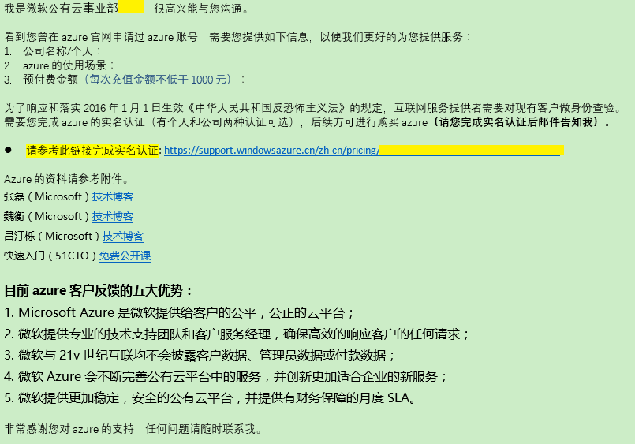

点击实名认证的链接完成实名认证

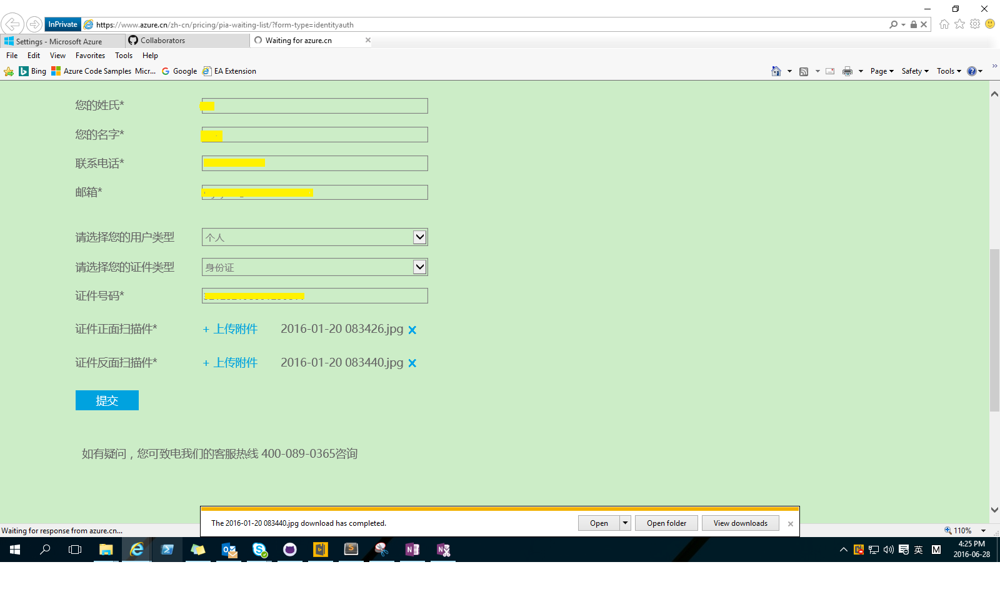

之后等待邮件，世纪互联会在稍后发送用于注册的邀请码。

## 注册流程

点击邮箱中Azure购买的激活链接，下图是邮件内容的截图

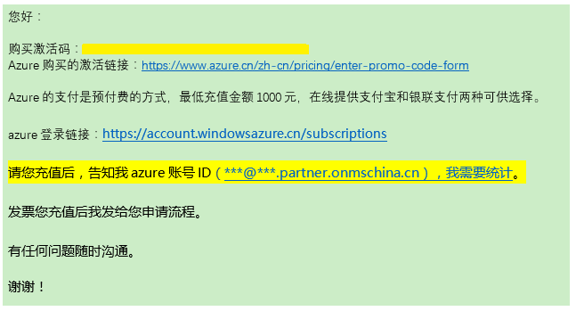

输入激活码，然后提交

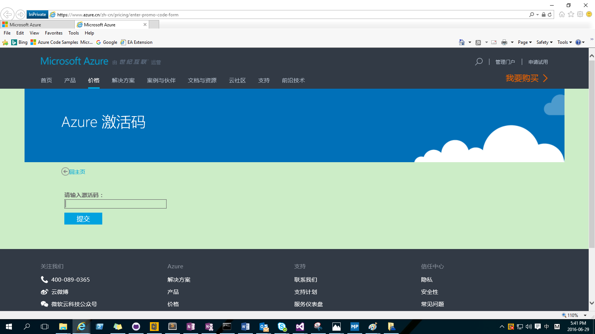

在下面的页面输入您的相关信息，输入域名，然后检查可用性

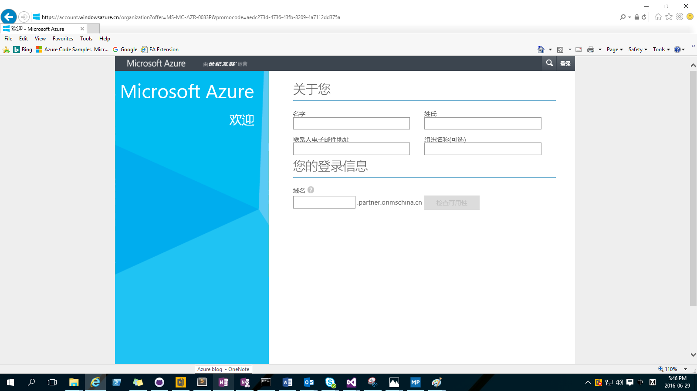

之后继续填写密码及手机验证，验证完毕后，点击继续
	
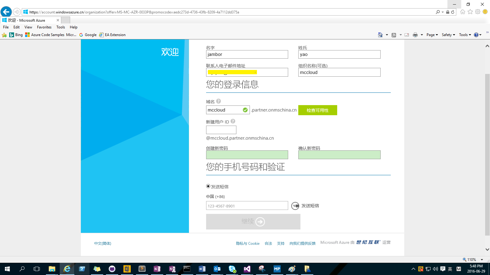

页面跳转到登录，输入之前创建的用户名和密码后点击登陆。登录过程中您也会收到关于您Azure账号相关信息的邮件。

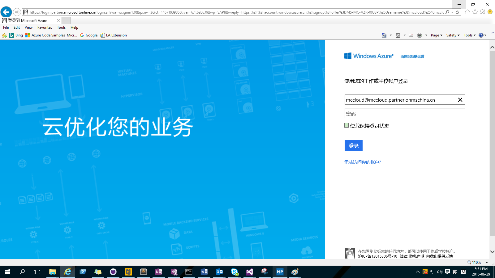

登录后页面跳转到付费相关信息的界面，注意付款金额必须大于1000元

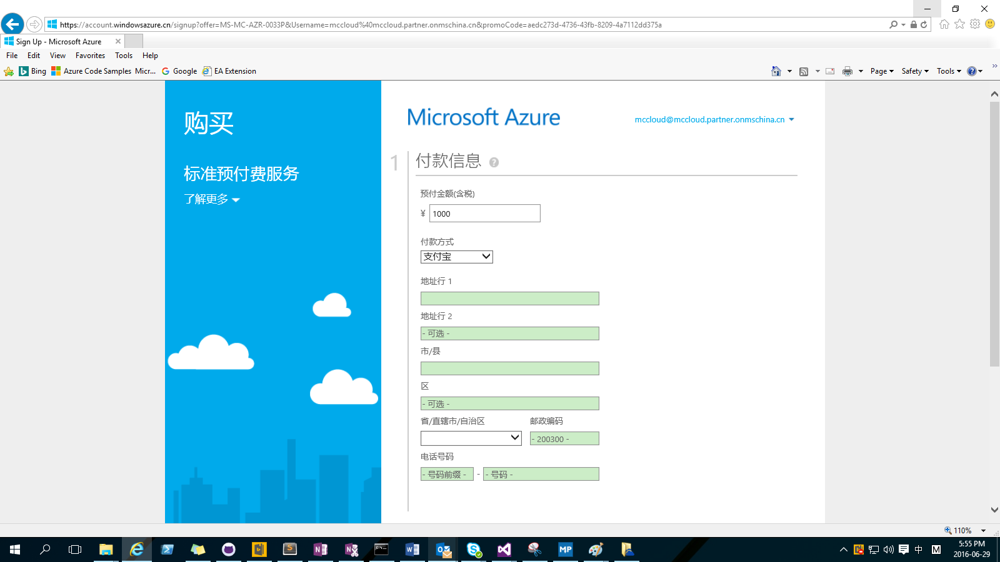

您可以选择您喜欢的支付方式（例子中为支付宝支付方式）

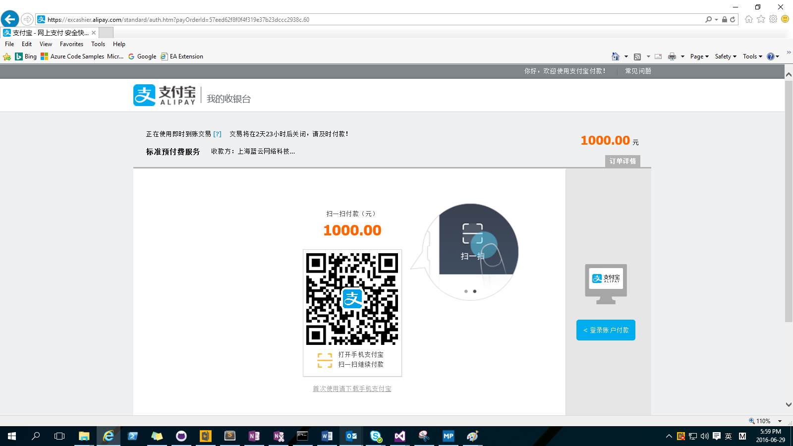

使用支付宝扫一扫整个注册就完成了！

