# Azure 1元体验账号详细申请过程

- [如何获得邀请码](#getcode)
- [通过邀请码注册体验账号](#register)
- [查看订阅详情及使用Azure管理门户](#info)

## 如何获得邀请码

登录[Azure官方网站](http://www.azure.cn),找到申请试用，然后填写试用申请表。

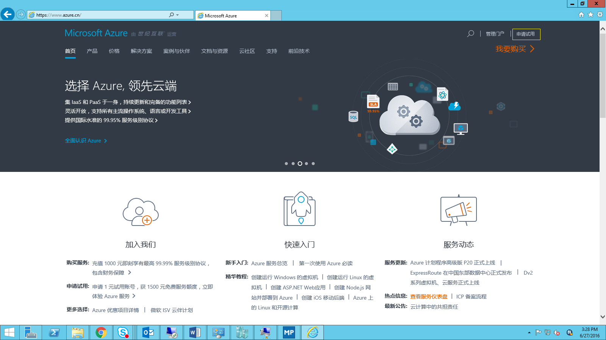

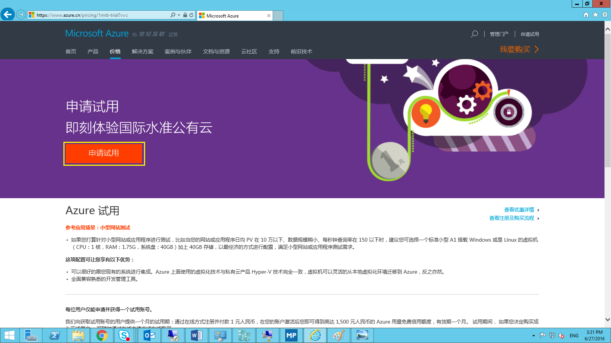

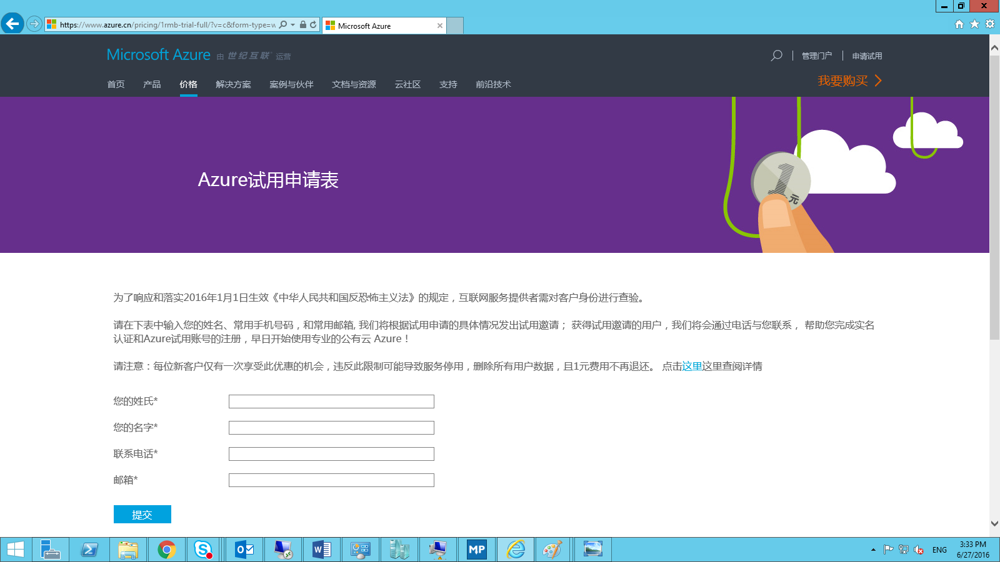

## 通过邀请码注册体验账号

二十一世纪互联会审核之前我们提交的信息，之后我们会收到邮件如下图，这期间可能需要一些时间，请耐心等待：

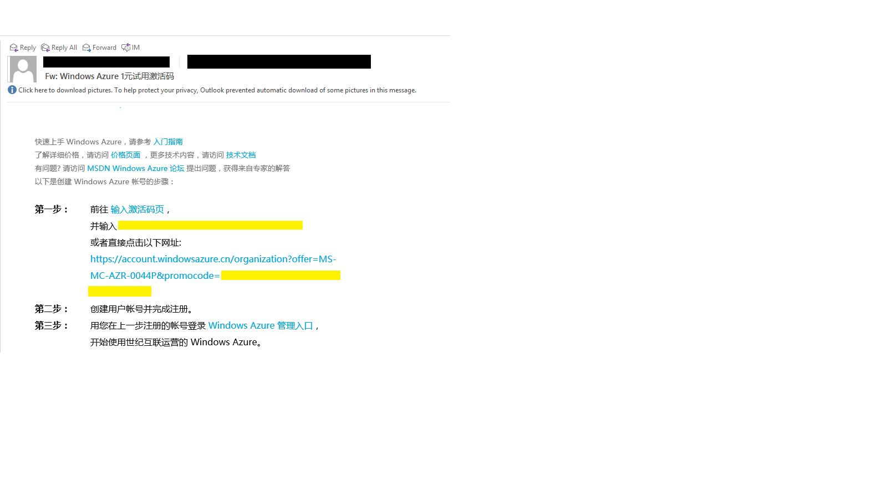

请复制邮件中的激活码，然后点击“输入激活码页”或者直接点击邮件中的注册网址开始注册：

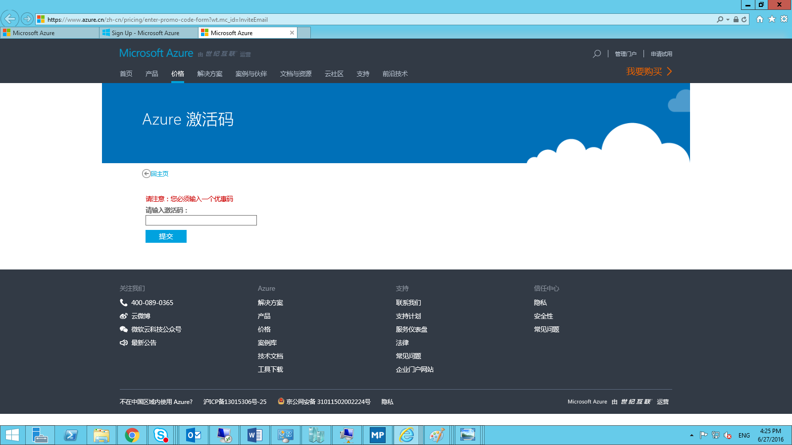

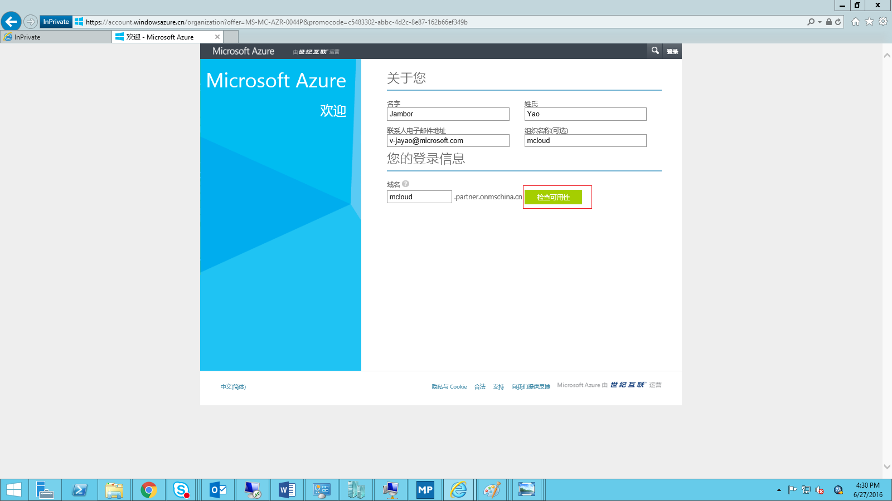

输入域名然后点击检查可用性

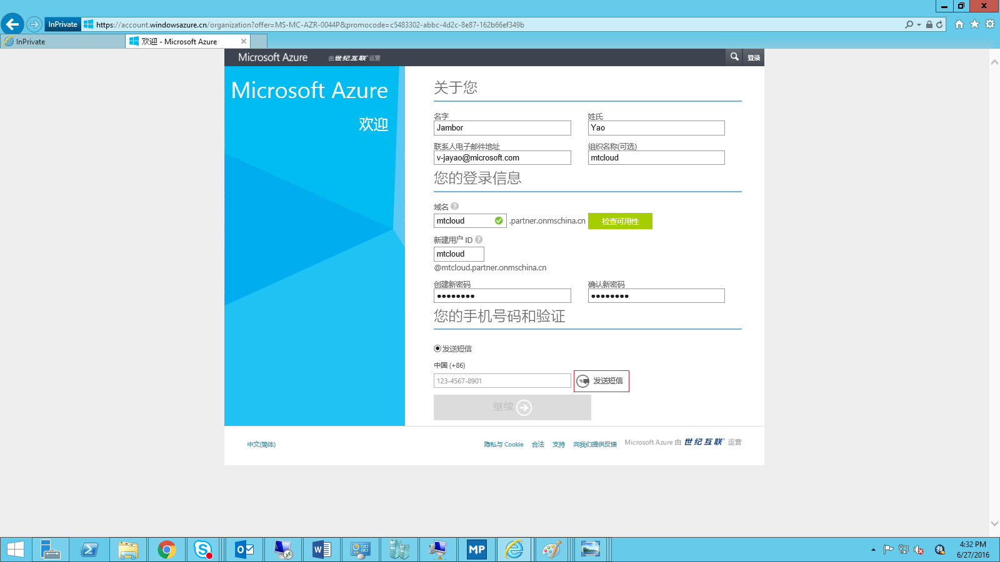

填入您的手机号码发送验证码，输入验证码点击“验证代码”，然后点击继续，这时跳入登入页面，输入之前设置的密码进行登录，同时我们也会收到世纪互联发送的关于我们Azure体验账号相关信息的邮件

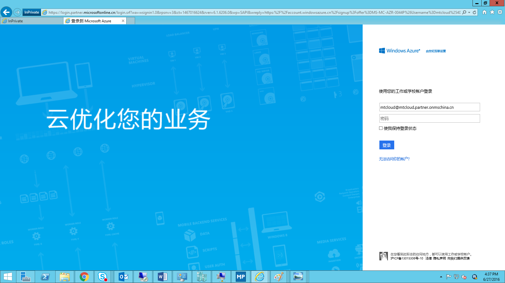

登录成功后进入付款页面。

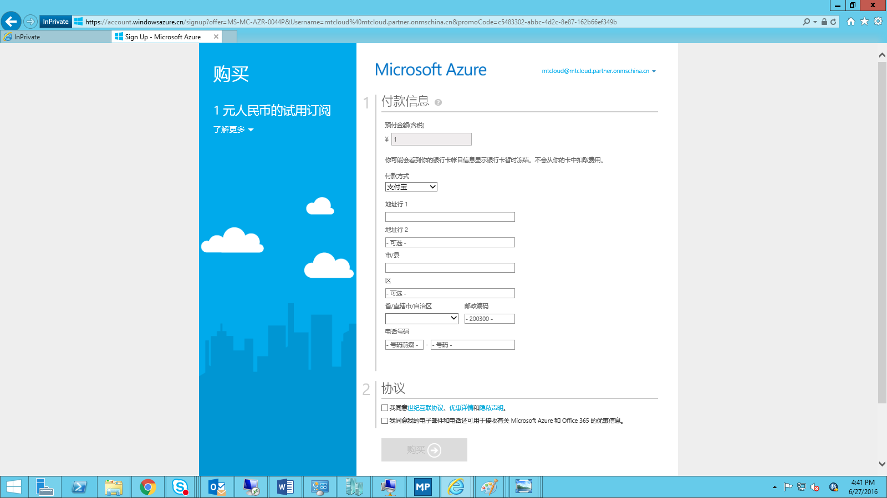

输入个人相关信息，点击“购买”（例子中选择支付宝支付方式）

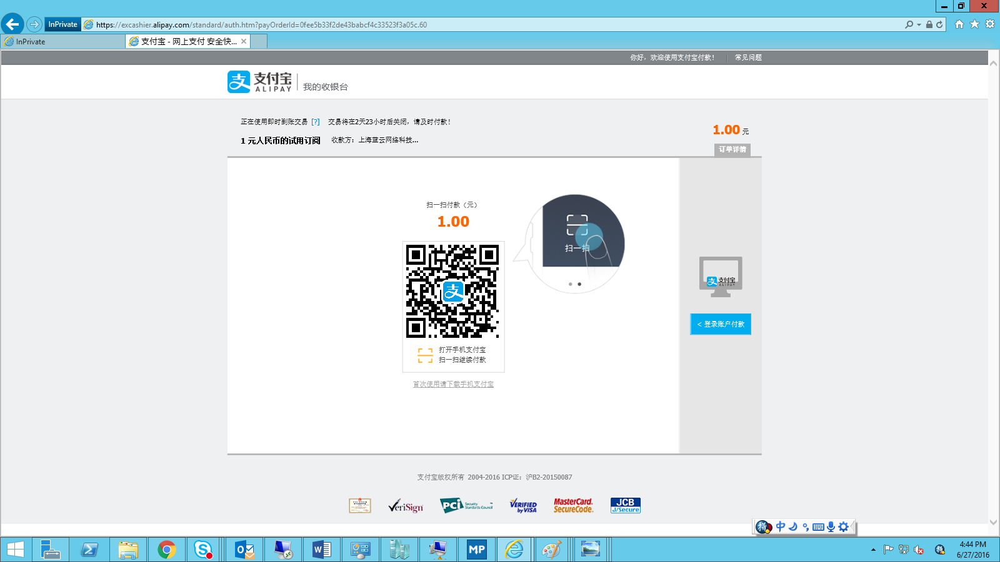

扫一扫完成支付，之后页面会跳转到Azure验证付款，整个注册就完成了。

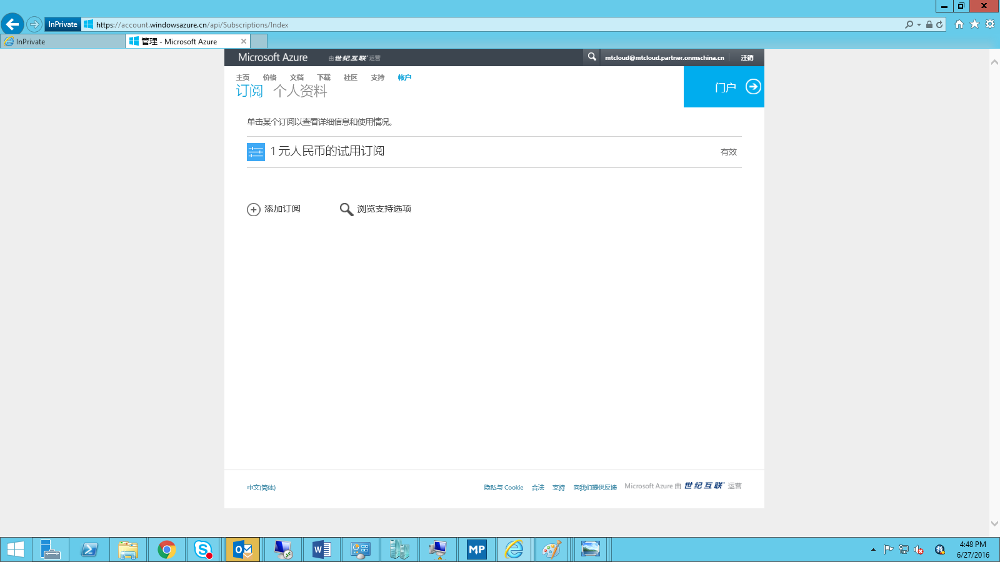

## 查看订阅详情及使用Azure管理门户

点击“1元人民币的试用订阅”查看订阅的使用情况，或者点击[Azure账户](https://account.windowsazure.cn/)，点击右上角登陆。

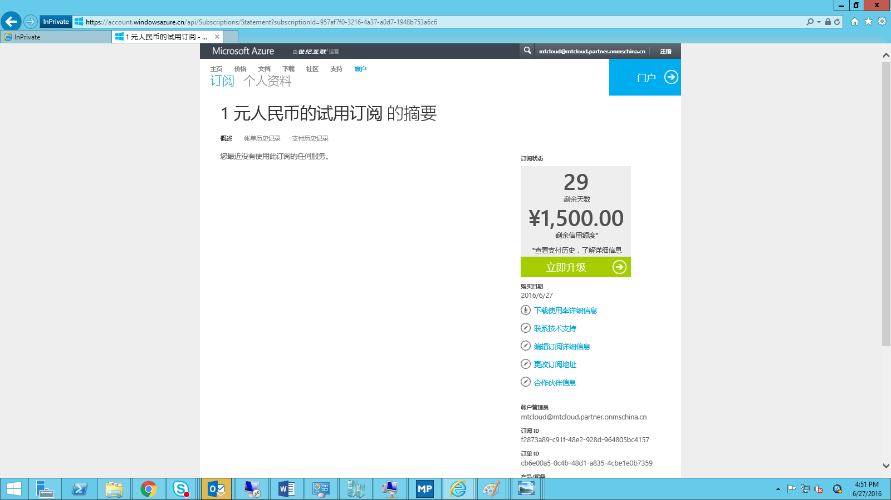

点击“门户”进入Azure管理门户

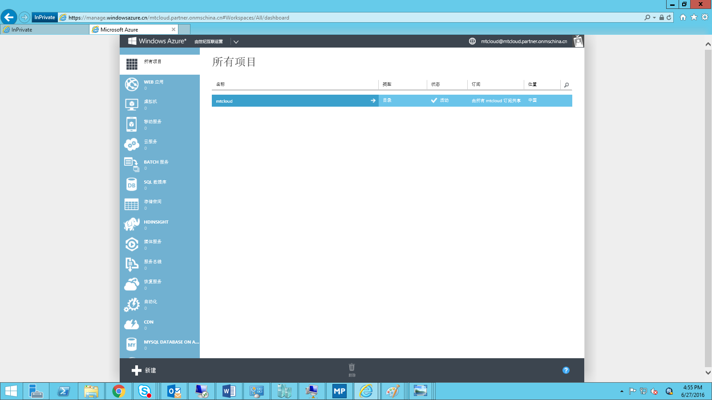

点击门户网站绿色的按钮查看大致的消费情况。

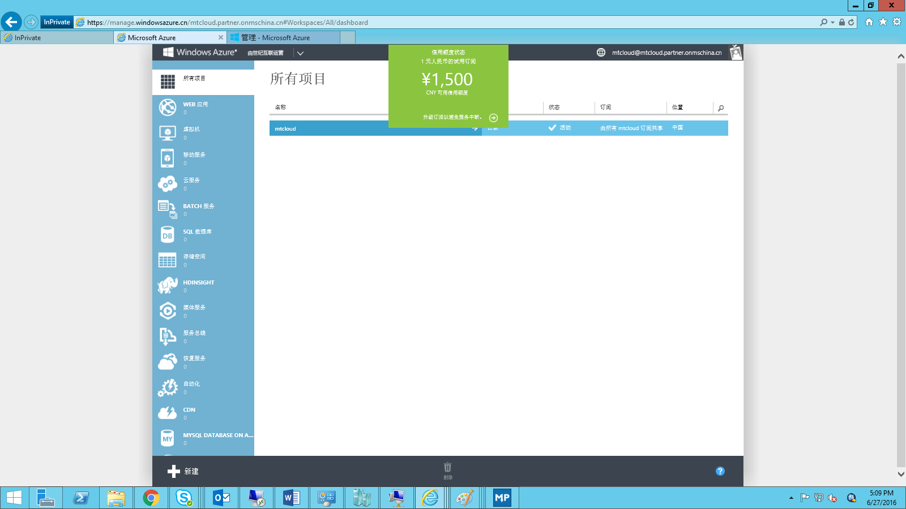

